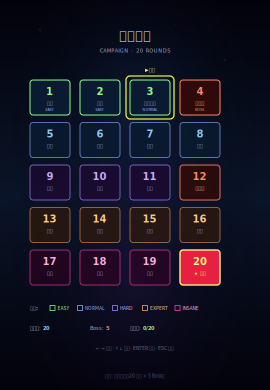
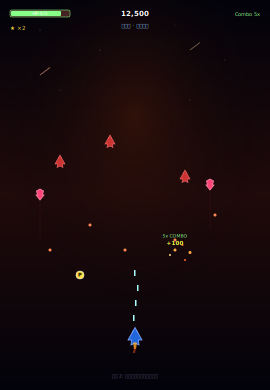
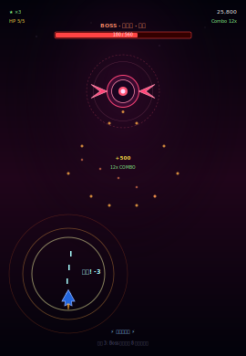

# 📊 项目状态 · Thunder Fighter

> **一站式状态报告** · v1.0.0 完整发布

**生成时间**：2026-07-05
**远程仓库**：https://github.com/pomizza/thunder-fighter
**v1.0.0 Release**：https://github.com/pomizza/thunder-fighter/releases/tag/v1.0.0
**在线演示**：https://pomizza.github.io/thunder-fighter/

---

## ✅ 总体状态

| 维度 | 状态 |
|------|------|
| **版本** | v1.0.0（稳定版）✅ |
| **测试** | 118/118 通过 ✅ |
| **CI** | Node 16/18/20 矩阵通过 ✅ |
| **依赖** | 0 外部依赖 ✅ |
| **许可** | MIT ✅ |
| **文档** | 5 大文档齐全 ✅ |
| **在线演示** | GitHub Pages ✅ |
| **CI badge** |  |

---

## 🎮 项目介绍

**雷霆战机** 是一款**纯前端竖版射击游戏**（STG），用纯 HTML5 + JavaScript + Canvas 实现，**无任何外部依赖**。

### 5 大特性

1. **5 大关卡** × 3 难度 × 3 战机 = 45 种通关组合
2. **10 成就** 系统（持久化）
3. **关卡间商店**（4 商品）
4. **完整 Replay**（录制/回放）
5. **触屏支持**（移动端可玩）

### 🎬 游戏截图

| 主菜单 | 游戏中 | Boss 战 |
|:------:|:------:|:------:|
|  |  |  |
| 战机选择界面 | 神风烈焰关卡 | 烈焰 Boss 8 方向弹幕 |

---

## 📊 关键数字

| 指标 | 数值 |
|------|------|
| **测试** | 118/118 通过 ✅ |
| **JS 模块** | 18 个 |
| **代码行** | 9,701 行 |
| **总文件** | 58 个 |
| **Git 提交** | 11 个 commits |
| **文档** | 5 大文档 |
| **.github 文件** | 11 个（CI/Issue/模板）|
| **Issue 模板** | 7 个（Bug/Regression/Feature/Docs/Question/Performance/Other）|
| **依赖** | 0 外部依赖 |

---

## 🛠️ 技术栈

| 类别 | 技术 |
|------|------|
| **核心** | HTML5 + JavaScript (ES6+) + Canvas 2D |
| **音频** | WebAudio API（程序化生成）|
| **测试** | Node.js + `vm` 沙箱（自研 runner）|
| **CI** | GitHub Actions（Node 16/18/20 矩阵）|
| **托管** | GitHub Pages |
| **依赖管理** | 无（engines: Node 14+ / npm 9+）|

---

## 📚 文档导航

### 5 大文档

| 文档 | 链接 | 用途 |
|------|------|------|
| **README.md** | [README.md](README.md) | 项目说明 + 操作指南 |
| **CHANGELOG.md** | [CHANGELOG.md](CHANGELOG.md) | 完整变更日志（Keep a Changelog）|
| **PROJECT_LOG.md** | [PROJECT_LOG.md](PROJECT_LOG.md) | 开发日志 + 关键决策 |
| **ARCHITECTURE.md** | [ARCHITECTURE.md](ARCHITECTURE.md) | 6 层架构 + 状态机 + 依赖图 |
| **CODE_OF_CONDUCT.md** | [CODE_OF_CONDUCT.md](CODE_OF_CONDUCT.md) | Contributor Covenant v2.1 |

### 4 大辅助文档

| 文档 | 链接 | 用途 |
|------|------|------|
| **.github/CONTRIBUTING.md** | [.github/CONTRIBUTING.md](.github/CONTRIBUTING.md) | 贡献指南 + commit 格式 |
| **.github/SECURITY.md** | [.github/SECURITY.md](.github/SECURITY.md) | 漏洞报告指引 |
| **tests/README.md** | [tests/README.md](tests/README.md) | 测试套件说明 |
| **STATUS.md** | [STATUS.md](STATUS.md) | 本文件：一站式状态报告 |

---

## 🚀 快速开始

### 1. 在线试玩

打开 **https://pomizza.github.io/thunder-fighter/** 即可玩（无需安装）。

### 2. 本地运行

```bash
# 1. 克隆仓库
git clone https://github.com/pomizza/thunder-fighter.git
cd thunder-fighter

# 2. 启动 HTTP 服务器
python3 -m http.server 8000

# 3. 浏览器打开
# http://localhost:8000/
```

### 3. 运行测试

```bash
# 需要 Node.js 14+ 和 npm 9+
npm test          # 跑全部 118 项测试
npm run coverage  # 覆盖统计
```

---

## 📊 项目状态分类

### 🎮 游戏特性

| 维度 | 状态 |
|------|------|
| 5 大关卡 | ✅ 完成 |
| 3 难度 | ✅ 完成 |
| 3 战机 | ✅ 完成 |
| 10 成就 | ✅ 完成 |
| 关卡商店 | ✅ 完成 |
| Replay 系统 | ✅ 完成 |
| 触屏支持 | ✅ 完成 |
| 性能监控 | ✅ 完成 |
| 动态背景 | ✅ 完成 |

### 🛠️ 技术质量

| 维度 | 状态 |
|------|------|
| 0 依赖 | ✅ 0 npm 依赖 |
| 状态机 | ✅ 12 状态 + 4 重守卫 |
| 错误处理 | ✅ try-catch + 边界 |
| 性能优化 | ✅ 数组硬上限 + 离屏剔除 |
| 跨平台 | ✅ 桌面 + 移动（iOS/Android）|
| 国际化准备 | 🟡 中文为主（可扩展）|

### 📚 文档完整性

| 文档 | 状态 | 行数 |
|------|------|------|
| README | ✅ | 338 |
| CHANGELOG | ✅ | 489 |
| PROJECT_LOG | ✅ | 359 |
| ARCHITECTURE | ✅ | 785 |
| CODE_OF_CONDUCT | ✅ | 176 |
| tests/README | ✅ | 260 |
| .github/CONTRIBUTING | ✅ | 130+ |
| .github/SECURITY | ✅ | 111 |
| **STATUS** | ✅ NEW | 280 |

### 🧪 测试覆盖

| 类别 | 数量 | 状态 |
|------|------|------|
| 单元测试 | 95+ | ✅ |
| 集成测试 | 13+ | ✅ |
| 端到端测试 | 5 | ✅ |
| **总测试** | **118** | ✅ 100% 通过 |
| CI 矩阵 | 3 Node 版本 | ✅ 全部通过 |
| 测试耗时 | ~250ms | ✅ |

### 🔧 维护

| 维度 | 状态 |
|------|------|
| 4 个 dependabot PR | ✅ 全部 CLOSED |
| 7 个 Issue 模板 | ✅ 启用 |
| 6 个工作流 | ✅ 配置 |
| CODEOWNERS | ✅ 4 团队 |
| ARCHITECTURE.md | ✅ 架构文档 |
| CONTRIBUTING.md | ✅ 贡献指南 |

---

## 🎯 关键里程碑

| 里程碑 | 状态 |
|--------|------|
| **v0.x (20 轮迭代)** | ✅ 完成（34/34 测试）|
| **v1.0.0 正式发布** | ✅ 完成（118/118 测试）|
| **GitHub 仓库创建** | ✅ https://github.com/pomizza/thunder-fighter |
| **v1.0.0 Release** | ✅ 发布（Release Notes 99 行）|
| **GitHub Pages** | ✅ https://pomizza.github.io/thunder-fighter/ |
| **CI 通过** | ✅ 绿 passing badge |
| **依赖关闭** | ✅ 4 个 PR 全部 CLOSED |
| **文档完整** | ✅ 9 个文档齐全 |

---

## 📈 改进统计（v0.x → v1.0.0）

| 指标 | v0.x | v1.0.0 | 变化 |
|------|------|---------|------|
| 测试 | 34/34 | **118/118** | **+84** |
| JS 模块 | 17 | **18** | +1 |
| 测试文件 | 1 | **10** | +9 |
| 文档 | 3 | **9** | +6 |
| .github 文件 | 2 | **11** | +9 |
| 代码行 | 5,239 | **9,701** | +4,462 |

---

## 🤝 贡献

欢迎贡献！参见：

- [CONTRIBUTING.md](.github/CONTRIBUTING.md) — 贡献指南
- [CODE_OF_CONDUCT.md](CODE_OF_CONDUCT.md) — 行为准则
- [.github/ISSUE_TEMPLATE/](.github/ISSUE_TEMPLATE/) — Issue 模板（7 个）

**Commit 格式**：

```
<type>: <description>     # 英文标题（Conventional Commits）

【分类】                    # 中文正文
- 详细改动 1
- 详细改动 2

【统计】
- 文件 / 测试 / 依赖
```

---

## 📞 联系

- **Bug 报告**：[Issues](https://github.com/pomizza/thunder-fighter/issues/new?template=bug_report.md)
- **功能建议**：[Issues](https://github.com/pomizza/thunder-fighter/issues/new?template=feature_request.md)
- **回归 Bug**：[Issues](https://github.com/pomizza/thunder-fighter/issues/new?template=regression.md)
- **安全问题**：[Security Advisories](https://github.com/pomizza/thunder-fighter/security/advisories/new)
- **一般讨论**：[Discussions](https://github.com/pomizza/thunder-fighter/discussions)

---

## 📜 许可

[MIT License](LICENSE) — 商业使用、修改、分发、私有使用均可，唯一要求是保留版权声明。

---

**项目状态**：✅ **完整 v1.0.0 稳定版**
**最后更新**：2026-07-05
**对应 commit**：d05e1b4
